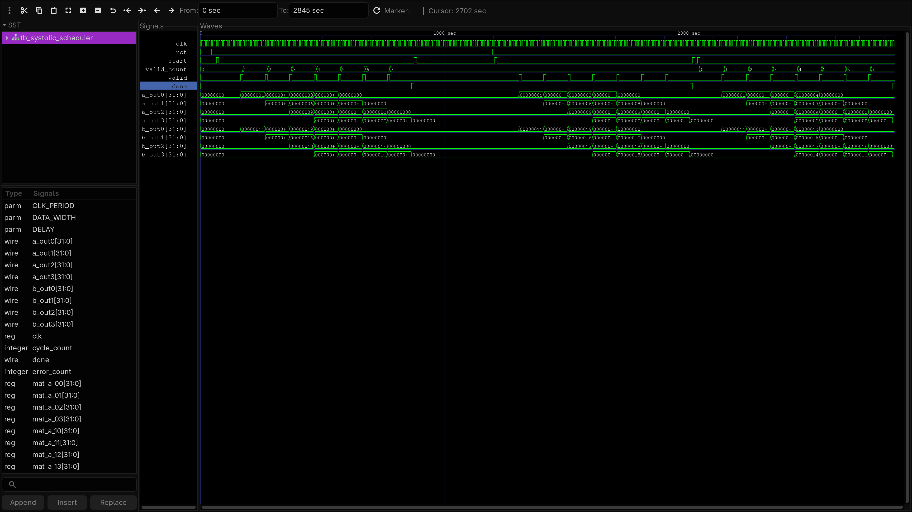
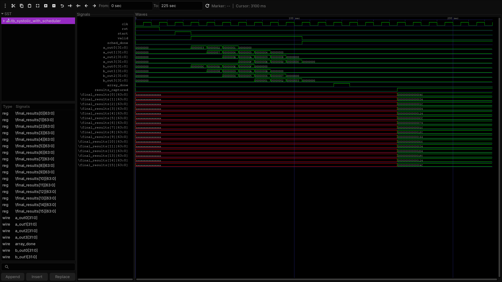

# Systolic Scheduler for 4x4 Matrix Multiplication

This repository implements a **Verilog-based scheduler** for driving a **4x4 Systolic Array**, designed to perform efficient matrix multiplication.
The project was developed in two phases:
1. **Standalone Scheduler Design** – Designed and verified the functionality of the scheduler.
2. **Full Integration** – Connected the scheduler to a 4x4 Systolic Array (design by a collaborator) and verified its operation for matrix multiplication.

<br/>

##  Project Structure
```
systolic-scheduler-4x4/
│
├── README.md 
│
├── images/ 
│ ├── scheduler_systolic4x4_wave.png
│ └── scheduler_wave.png
│
├── src/ # Scheduler only
│ ├── systolic_scheduler.v # Core scheduler module
│ ├── scheduler_tb.v # Testbench for standalone scheduler
│ ├── a.out
│ └── systolic_scheduler.vcd 
│
├── systolic_env/ # Full integration environment
│ ├── 4x4_Systolic_Array.v # Main systolic array design
│ ├── block.v # part of systolic array design
│ ├── systolic_scheduler.v # Same scheduler file used for integration
│ ├── tb.v # Base testbench of systolic array
│ ├── tb_with_scheduler.v # Full testbench including scheduler
│ ├── test 
│ └── systolic_debug.vcd 
```
<br/>

## Running the Simulations
### Standalone Scheduler Test

```bash
cd src
iverilog systolic_scheduler.v scheduler_tb.v -o a.out
vvp a.out
gtkwave systolic_scheduler.vcd
```

### Full System Test with 4x4 Systolic Array
```
cd systolic_env
iverilog tb_with_scheduler.v 4x4_Systolic_Array.v systolic_scheduler.v block.v -o test
./test
gtkwave systolic_debug.vcd
```

## Output Waveforms
### Scheduler Only Simulation
Shows the timing and control signals generated by the scheduler.


## Scheduler + Systolic Array Simulation
Verifies proper matrix multiplication driven by the scheduler.


## Collaborator Acknowledgment
The 4x4 systolic array design was developed by a collaborator.
A link to their GitHub repository will be added once available.
